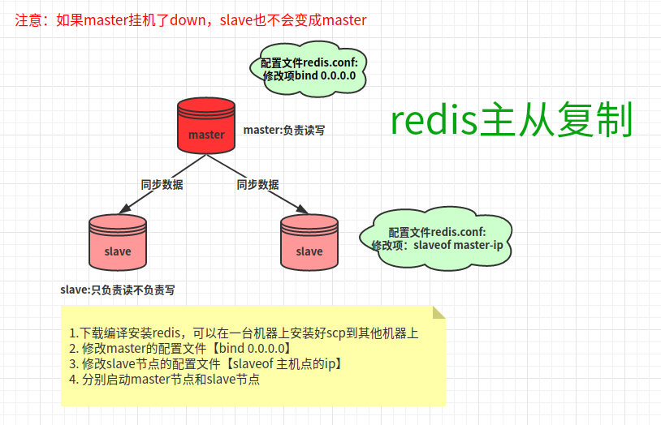
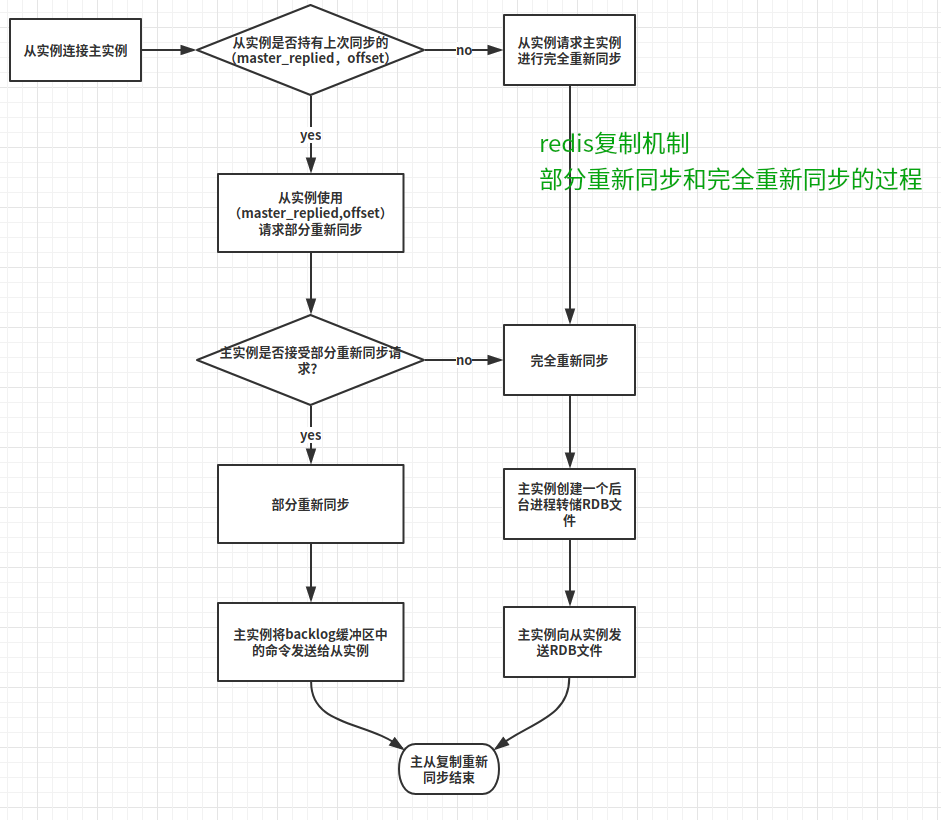

# 【Chapter-5】Redis复制

# 复制

在本章中，我们将学历下列案例：
  - 配置redis的复制机制
  - 复制机制的调优
  - 复制机制的故障诊断


-----




redis复制机制，使得数据能够从一个redis服务器（master，主实例）复制到一个或者多个其他的redis服务器中（slave，从实例）
复制不仅提高了整个系统的容错能力，还可以用于对系统进行水平扩展，在一个重读取的应用中，我们可以通过增加多个redis只读从实例来减轻主实例的压力。
redis的复制机制是redis-cluster的基础，redis-cluster在此基础上提供了高可用性。
redis的slave节点只读不写，master节点可写可读
如果master down了，slave也不会切换成master


## 配置redis的复制机制

默认情况下，redis服务器是以主实例模式运行的。在本案例中，我们将演示如何配置redis的主从同步

1. 首先我们可以将之前编译安装好的redis给slave主机复制一份`scp -r /redis root@172.18.113.63:/`
2. 修改slave节点的配置文件`slaveof 172.18.113.66 6379`
3. 修改master节点的配置文件`bind 0.0.0.0`（也可以修改成自己的ip）
4. 分别启动master节点和slave节点，登录上master节点和slave节点，执行命令`info replication`
5. 在master节点上写一个key，在slave节点上可以查询到这个key

```bash
#master节点
[root@wms-redis-test-1 redis]# bin/redis-cli 
127.0.0.1:6379> info replication
# Replication
role:master
connected_slaves:1
slave0:ip=172.18.113.63,port=6379,state=online,offset=28,lag=1
master_replid:ff4ec518a0eda001c6efdf966f4ab1444fdef9b0
master_replid2:0000000000000000000000000000000000000000
master_repl_offset:28
second_repl_offset:-1
repl_backlog_active:1
repl_backlog_size:1048576
repl_backlog_first_byte_offset:1
repl_backlog_histlen:28
127.0.0.1:6379>

#slave节点
[root@wms-redis-test-2 redis]# bin/redis-cli
127.0.0.1:6379> info replication
# Replication
role:slave
master_host:172.18.113.66
master_port:6379
master_link_status:up
master_last_io_seconds_ago:3
master_sync_in_progress:0
slave_repl_offset:42
slave_priority:100
slave_read_only:1
connected_slaves:0
master_replid:ff4ec518a0eda001c6efdf966f4ab1444fdef9b0
master_replid2:0000000000000000000000000000000000000000
master_repl_offset:42
second_repl_offset:-1
repl_backlog_active:1
repl_backlog_size:1048576
repl_backlog_first_byte_offset:1
repl_backlog_histlen:42

```

## 复制机制的调优


1. slave节点默认是只读模式，这是因为配置选项`slave-read-only yes`,在大多数情况下，最好保持这种配置，避免主从实例之间的数据不一致
2. 配置选项`repl-backlog-size 1mb`默认是1m，offset不在这个范围内，仍然将发生完全数据同步，利用不到部分数据同步的优势，可以将这个选项配置的适当大一点，具体大小可以参考书上的计算公式
3. 选项`repl-backlog-ttl 3600`，如果所有的从实例和主实例的连接全部断开，那么主实例等待多久释放backlog占用的内存，默认值是3600s；
4. 选项`repl-disable-tcp-nodelay no`，从网络传输的角度看，设为yes来减少带宽的使用，redis会尝试讲几个小包合并成一个包，这在主实例和从实例的位置相距较远时有些作用，但是需要额外注意的是，这个选项可能造成40ms的复制延迟；
5. 选项`repl-diskless-sync no`,从住市里的i/o和内存角度看，我们可以通过使用无磁盘复制直接将RDB的内容发送给从实例而无需在磁盘上创建RDB文件，这种机制可以在RDB快照过程中节省大量的磁盘读写和内存，如果reids所在的主机上的磁盘速度不快或者内存使用很高，而网络宽带又足够，那么我们可以考虑打开这个选项，但是，这个特性目前仍然处于实验阶段，生产环境使用无磁盘复制要多加小心。


